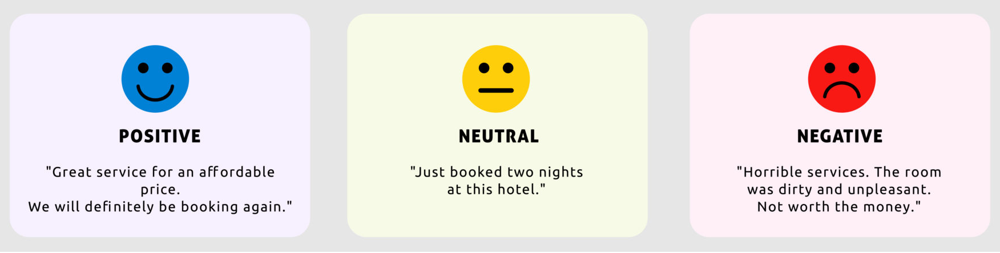
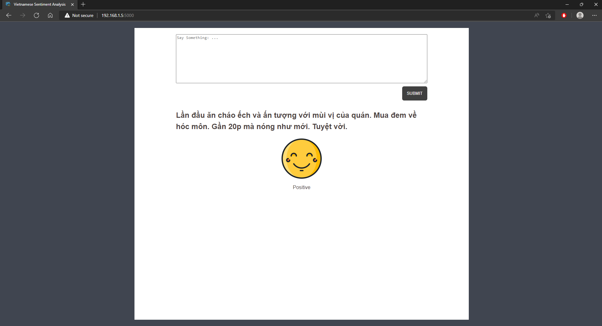

## Vietnamese Sentiment Analysis


### Introduction
Sentiment analysis is the process of analyzing online pieces of writing to determine the emotional tone they carry, whether they are **positive**, **negative**, or **neutral**. In simple words, sentiment analysis helps to find the author’s attitude towards a topic.
<p align='middle'></p>


### Dataset
This project aims to analyse the sentiments of vietnamese food comments crawled from [Foody](https://www.foody.vn/) along with their ratings. Since the rating range is from 0 to 10, I proceeded to reassign the value according to the following rules:
| Sentiment     | Condition            |
| ------------- | -------------------- |
| Negative      | (rating < 4) or NaN  |
| Neutral       | 4 ≤ rating ≤ 7       |
| Positive      | rating > 7           |


### Training and Evaluation
[](https://drive.google.com/drive/folders/1RrUjuS0tffVOgOCqgP6BVhPvayzOPOH7?usp=sharing)


### How to use
* Step 1: Automatically install all dependencies from `requirements.txt`.
    ```
    pip install -r requirements.txt
    ```
* Step 2: Configure hyper-parameters in `config.py` and start server.
    ```
    python app.py
    ```
<p align='middle'></p>


### References
1. [Quan-Hoang Vo; Huy-Tien Nguyen; Bac Le; and Minh-Le Nguyen. Multi-channel LSTM-CNN model for Vietnamese sentiment analysis. In KSE, 2017.](https://ieeexplore.ieee.org/document/8119429?fbclid=IwAR0c263mQOKFh3RP7XpcgSV_cC6qYXTyi3e_bvqKB0FOejLBuCtkQudkAPQ)
2. [QuangPH. Phân tích phản hồi khách hàng hiệu quả với Machine learning. In Viblo, 2018.](https://viblo.asia/p/phan-tich-phan-hoi-khach-hang-hieu-qua-voi-machine-learningvietnamese-sentiment-analysis-Eb85opXOK2G)